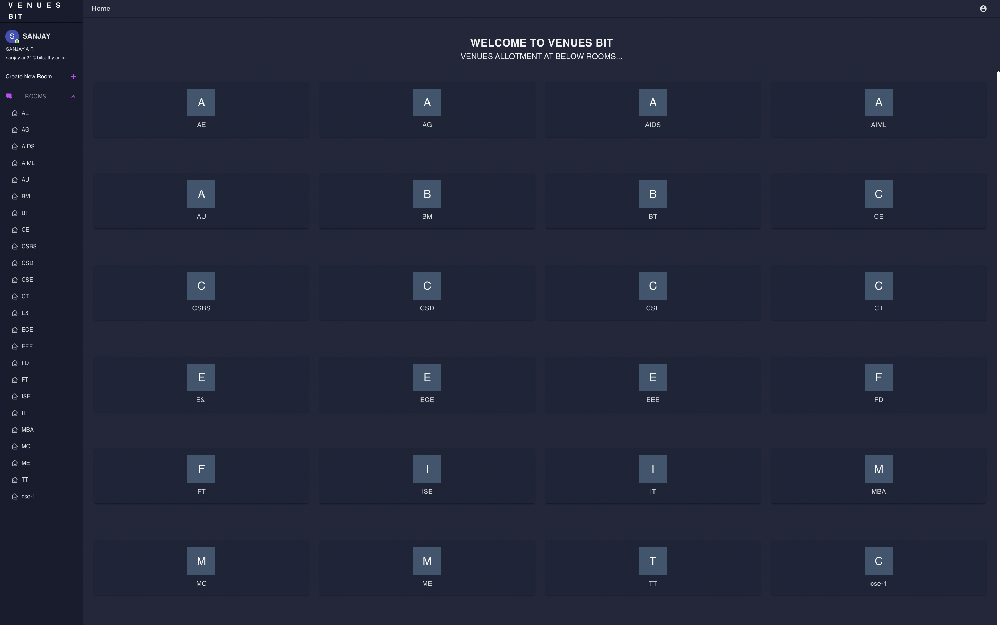

# VENUES BIT

###  Chat Room For Teachers to share Infos with Students.

### In Progress

  

## Build With

- `React.js`
- `Firebase`
- `Material UI`
- `React Icons`

## Features:

- Easy SignIn with Google
- Create Rooms
- Realtime Intreaction With Students
- Supports Emoji
- Reaction on messages

## Installation and Usage

### Clone this repository

`git clone https://github.com/soumyajit4419/VENUES.git`  
`cd chatify`

### Install Dependencies

`npm install`

In the project directory, you can run:

### npm start

Runs the app in the development mode.\
Open [http://localhost:3000](http://localhost:3000) to view it in the browser.

The page will reload if you make edits.\
You will also see any lint errors in the console.

### npm run build

Builds the app for production to the `build` folder.\
It correctly bundles React in production mode and optimizes the build for the best performance.
